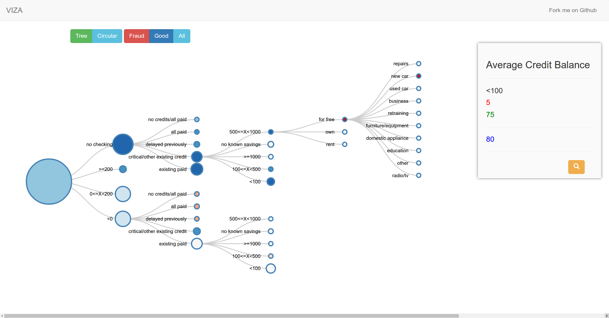

# viza
Visualization of credit card fraud data to see the patterns using `D3.js`

##Data
This visualization is done using German Credit card data which is available here: [http://weka.8497.n7.nabble.com/file/n23121/credit_fruad.arff](http://weka.8497.n7.nabble.com/file/n23121/credit_fruad.arff). You need to convert this to csv and place it in *data.csv*.

